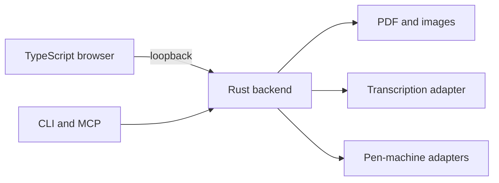

# Atrament

**An artificial penmanship atelier that alchemizes text, lectures, formulas,
and photographs into uncannily human notebooks—PDF or real ink.**

Atrament is a disposable localhost workspace for composing polished handwritten
notes. Paste an assignment, describe the desired result to an LLM, inspect the
structured response beside the page, correct it by hand, and export the same
notebook to PDF or a compatible pen-writing machine.

It is not a word processor, a handwriting font, or a cloud notebook. Content is
semantic, layout is compiled against a physical page, handwriting comes from a
calibrated personal profile, and every visual adjustment remains an explicit
constraint.

> [!IMPORTANT]
> Atrament is under active implementation. The repository includes the thin
> TypeScript browser workspace; backend-owned product behavior remains the
> authoritative implementation boundary as the roadmap is completed.

## The workspace

The primary interface is a 16:9 split workspace with both editors visible:

- **LLM editor:** task, structured notebook source, validation diagnostics, and
  the one-shot chat exchange.
- **Human editor:** live page preview, text correction, selection, movement,
  resize, crop, layering, and physical-page controls.

The first LLM workflow requires no embedded model account:

1. Paste the task, notes, formulas, sources, and optional images.
1. Select a handwriting profile, paper, style, and output mode.
1. Press the permanent **Copy prompt** button.
1. Paste that self-contained prompt once into the chosen chat.
1. Paste the structured response back into the LLM editor.
1. Resolve validation, source, glyph, collision, and overflow diagnostics.
1. Adjust the accepted page in the human editor.
1. Export PDF or compile a live writing plan.

The copied prompt includes the complete backend-owned return format, page
constraints, source rules, style vocabulary, and return envelope. It never
depends on hidden prior chat context.

After a notebook is accepted, Atrament also supports a semantic command mode.
Instead of regenerating the notebook, an LLM can return a versioned batch of
typed operations against stable notebook identities and a specific base
revision. The backend validates the complete batch atomically, applies only its
accepted semantic effects, and recomputes only derived regions invalidated by
those effects and their dependencies.

The same command model is available through clipboard-assisted chat, CLI, and
MCP. Clipboard responses remain untrusted until backend validation and review;
an explicitly invoked CLI or MCP apply operation can automate the same validated
transaction without requiring a browser click.

## What a notebook can contain

The initial semantic vocabulary covers the material expected in serious school
notes and assignments:

- headings, dates, paragraphs, quotations, lists, and definitions;
- citations, source notes, footnotes, and unresolved claims;
- inline and displayed mathematics, aligned work, matrices, and units;
- tables, boxes, dividers, arrows, labels, and page references;
- photographs, transparent line art, diagrams, and clipped regions;
- highlights, callouts, margin notes, and digital paper notes;
- multiple handwriting roles for body text, titles, labels, and annotations.

An LLM may organize and format content, but a plausible citation is not proof.
Atrament distinguishes material supplied by the user, derived material, cited
claims, and unresolved claims so the human can review them before export.

## Page geometry

Every page uses physical units. The user controls:

- sheet size, orientation, and printable region;
- blank, ruled, dotted, squared, or custom paper;
- grid or rule spacing and color;
- binding edge, outer margin, and top clearance;
- inner writing inset between the margin and content;
- border shape, corner roundness, and layer order;
- measured ruler error and controlled grid imperfection;
- default body, title, caption, and annotation sizes.

Flowing content moves to another page. Fixed content that crosses the writable
region produces a blocking diagnostic; nothing silently vanishes outside the
sheet.

## Images and drawings

Clipboard and file intake initially support PNG, JPEG, and WebP. An image can be
placed behind text, inline, above text, or inside a clipped region and exposes
position, size, crop, opacity, and z-order.

For simple educational drawings, Atrament can derive transparent single-color
line art with configurable levels. The intended result is readable black ink
that can be colored by hand later, not a muddy grayscale photograph.

## Two honest output modes

| Capability | Digital / PDF | Live / pen machine |
| --- | --- | --- |
| Ink | Multiple simulated colors | One calibrated physical pen |
| Titles | Decorative and layered | Sober, single-pen geometry |
| Highlights | Marker and color layers | Underline, box, spacing, or weight |
| Photographs | Color, crop, texture | Converted transparent line art |
| Paper notes | Fill, fold, and shadow | Unsupported |
| Page | Any configured printable page | One blank, flat, calibrated sheet |
| Drawing | Raster, vector, or line art | Single-color vector paths |
| Output | PDF and print | Validated motion plan |

Unsupported live objects are reported individually. Atrament never drops a
color, photograph, shadow, sticky note, or tool change merely to make a motion
plan compile.

A future compact, quiet, multi-tool writer may add physical colors and pen
changes through a new capability profile. It is not part of the initial live
contract.

## Visual language

The target is organized handwriting, not random decoration. Reference notebooks
contribute a shared grammar:

- one dominant title and unmistakable section hierarchy;
- short columns and bounded modules for dense material;
- tables and rules that are measured but not machine-perfect;
- highlights used for hierarchy rather than indiscriminate color;
- compact line diagrams, labels, arrows, and deliberate whitespace;
- handwriting and ruler variation that remains controlled and legible.

Digital themes may be colorful, layered, and playful. Live themes preserve the
same hierarchy with one pen through scale, spacing, boxes, underlines, and
line-art diagrams.

## Handwriting model

A portable `.atrament` profile records the writer's calibration evidence,
stroke vocabulary, contextual forms, joins, pen lifts, dimensions, variation
bounds, paper relationship, and pen or ink presets.

The renderer does not stamp a font repeatedly. It plans continuous strokes and
uses correlated, seeded variation across page, line, word, character, and
stroke scales. Controls include height, width, slant, roundness, flattening,
baseline drift, spacing, speed, pressure proxy, and alternate forms.

English and Spanish are the first complete language baseline. Profiles cover
their letters and diacritics, opening punctuation, curly quotations,
apostrophes, ellipsis, en and em dashes, and the admitted mathematical symbols.
Missing coverage is visible and blocking unless the user accepts a declared
fallback.

## Rendering

Rust produces authoritative geometry on the CPU:

1. semantic blocks compile into physical layout boxes;
1. handwriting compiles into stroke centerlines and ink contours;
1. equations, tables, rules, and diagrams remain vector geometry;
1. ink, edge, deposition, paper, and highlight textures form separate layers;
1. bounded soft noise unifies the page without moving geometry;
1. PDF, preview, and live motion consume the appropriate shared authorities.

The same accepted document, profile, paper, assets, material presets, and seed
produce the same layout and stroke plans. No CUDA, WebGPU, or discrete compute
GPU is required.

## Architecture

- **Rust backend:** document model, physical units, layout, handwriting,
  deterministic CPU rendering, diagnostics, PDF, CLI, MCP, and motion plans.
- **TypeScript frontend:** localhost interaction, clipboard, split editors,
  direct manipulation, preview presentation, and accessibility. It has no
  runtime package dependency or independent domain-validation layer.
- **Hexagonal boundaries:** the browser and agents are inbound adapters;
  codecs, transcription, files, and physical writers are outbound adapters.
- **Ephemeral session:** no account, cloud sync, database, or autosave. Only an
  explicit import or export persists beyond the current localhost session.

The frontend never becomes a second layout engine, and hardware adapters never
become notebook authorities.

## Hardware compatibility

Compatibility is capability- and model-specific. Atrament distinguishes:

1. vector file export for vendor software;
1. a managed vendor CLI adapter;
1. a documented command-protocol adapter;
1. a direct device adapter with status and recovery.

Initial research baselines include:

- [NextDraw CLI](https://bantam.tools/nd_cli/) for SVG plotting, preview,
  configuration, pause, and resume control;
- [AxiDraw's SVG and interactive API](https://axidraw.com/doc/py_api/),
  including pen motion, preview, pause, and resume behavior;
- documented Graphtec devices with a plotting pen and HP-GL or GP-GL command
  modes, such as the [FC9000](https://graphtecamerica.com/fc9000/).

None is called supported until its exact model, firmware, transport, paper,
pen, usable area, homing, interruption, and safe-stop behavior pass physical
acceptance.

## Repository map

- [`TODO.md`](TODO.md) is the unfinished delivery sequence.
- [`docs/adr/index.yml`](docs/adr/index.yml) catalogs durable decisions.
- [`.jig/jig.toml`](.jig/jig.toml) anchors repository governance.
- [`docs/technical/index.yml`](docs/technical/index.yml) reserves measured
  implementation evidence and contracts.

## Responsible use

Use handwriting profiles created by, or with the explicit authorization of,
the represented writer. Atrament supports personal notes, accessibility,
authorized document production, and physical pen workflows; it does not make a
claim about who physically wrote an exported page.

## License

Atrament is licensed under the [MIT License](LICENSE-MIT).
